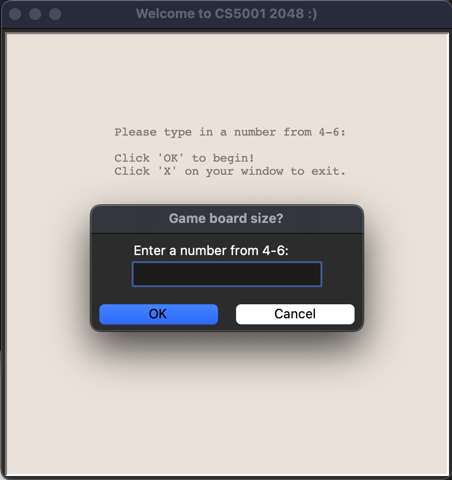

Linda Quach
CS 5001 - Spring 2023
Final Project - 2048

# HIGH-LEVEL DESIGN:
    The game of 2048 is a simple 1-player board game, comprising of a 4x4 grid of
    numbers. The player starts with two numbers (2 or 4) on the board, and in each
    turn, the player can move the numbers up, down, left, or right. 

    If two numbers are of the same value, the numbers merge into one, & the value
    of the new number is the sum of the two, essentially "sliding" the numbers
    together. The numbers can only slide in a direction to occupy the farthest
    cell without jumping over another number. 

    The player's goal is to obtain the number 2048 on the board. Game ends when
    this is obtained, or the board is full and no more moves can be made. If the
    player obtains a win, they may continue playing until the board is full.

    1. functions_2048.py:
        The 2048 game was designed in 2 layers in mind: the logic and the turtle graphics. The game is comprised of several core functions all located within the functions_2048.py file. Imports from the Python Turtle and Random libraries are used. The following functions within the file are group by their main functionality:

            -- core game functions --
                These functions are essential to the logic of the game. They collectively include the functions necessary to start a game, update the board state based on player moves, add new numbers with each turn, and handle game-over or winning conditions.
                    * new_game()
                    * move_left()
                    * move_right()
                    * move_up()
                    * move_down()
                    * initialize_board()
                    * add_new_number()
                    * check_game_over()
                    * check_win()

            -- game window setup functions --
                These functions serve to initialize & setup the main game window by
                retrieving grid size via an initial turtle input window. After retrieving the grid size, the main game window is openned and the initial game board is drawn.
                    * start_window()
                    * get_grid_size()
                    * draw_grid()

            -- display texts & score functions --
                These functions serve to display the turtle graphic texts, such as menu options, score. They also print text to the terminal for the user to look back at the game history.
                    * update_score()
                    * display_score()
                    * print_stacked_list()
                    * display_menu()
                    * display_game_over()
                    * display_win()

            -- key binding functions --
                These functions bind the arrow keys to the game logic in order to control the game and bring the logic and graphics together.
                    * key_binding()
                    * key_error()
    
    2. main.py: 
        The main.py file contains the main() function to run & execute the game, 
        which utilizes the functions in functions_2048.py. Within the main(), we utilize the function new_game() to boot up the game logic and then Turtle graphics's turtle.mainloop() to keep the window open until the user closes the game. After the turtle game window is closed, there is a thank you message printed to the terminal.

# HOW TO RUN THE GAME:
    1. Ensure that both functions_2048.py and main.py are in the same directory.
    2. Open main.py and run the program.

# INSTRUCTIONS & GAME CONTROLS:
    1. Upon starting the game, type in a size for the game board (4, 5, or 6). For example, a size 4 creates the default 4x4 grid of tiles. After selecting a size, click "OK" to start the game.
    2. Use the arrow keys on your keyboard to move the number tiles on the board. Player may move left, right, up, or down each turn of the game. When a valid move is made, and the tile is moved, a new random tile will appear.
    3. Press 'r' on the keyboard to restart the game, reprompting you to select a grid size in bullet point 1.
    4. Press 'e' on the keyboard to exit the program. This closes the turtle window, and ends the game.
    5. The game ends when there are no more moves left, meaning it is a "Game Over". A messege will display to let the player know it is Game Over.
    6. When the player reaches a tile with the value of 2048, they win! However they may continue to play to obtain even higher tile numbers or until no more moves are possible.

# WORKING FEATURES:
    1. The screen shows the board with numbers clearly, with matching tile colors.
    2. Generates a random starting board with two tiles with the value of 2 or 4.
    3. Allows the player to move tiles in all four directions using the arrow keys.
    4. Merges adjacent tiles with the same value when moved in a direction. If there are 3 same numbers adjacent, the tiles furthest in that direction will merge first.
    5. Adds a new tile with the value of 2 or 4 in a random empty spot on the board after every move.
    6. The game tracks the score and displays it on the board at all times.
    7. The menu options are hinted at the top of the board at all times.
    8. Allows the player to restart the game or exit the program at any time.
    9. If the player presses any keys other than what the game uses, it will not affect the gameplay.
    10. Program should not crash in long durations of gameplay, or fast playstyles although button mashing isn't recommended.

# BONUS FEATURES:
    1. If the player presses any keys other than what the game uses, the screen will display an "Invalid key!" message accordingly.
    2. When cells merge, it will be highlighted by using a different color.
    3. Starting the game allows for customization of 3 different sizes for the game grid. Sizes create 4x4, 5x5, or 6x6 grids. With a 6x6 being the easiest to win.
    4. After obtaining a win, player may continue to play, with colors of tiles being highligted up to 8192.
    5. Player can view history of their moves each turn printed on the terminal.
    
